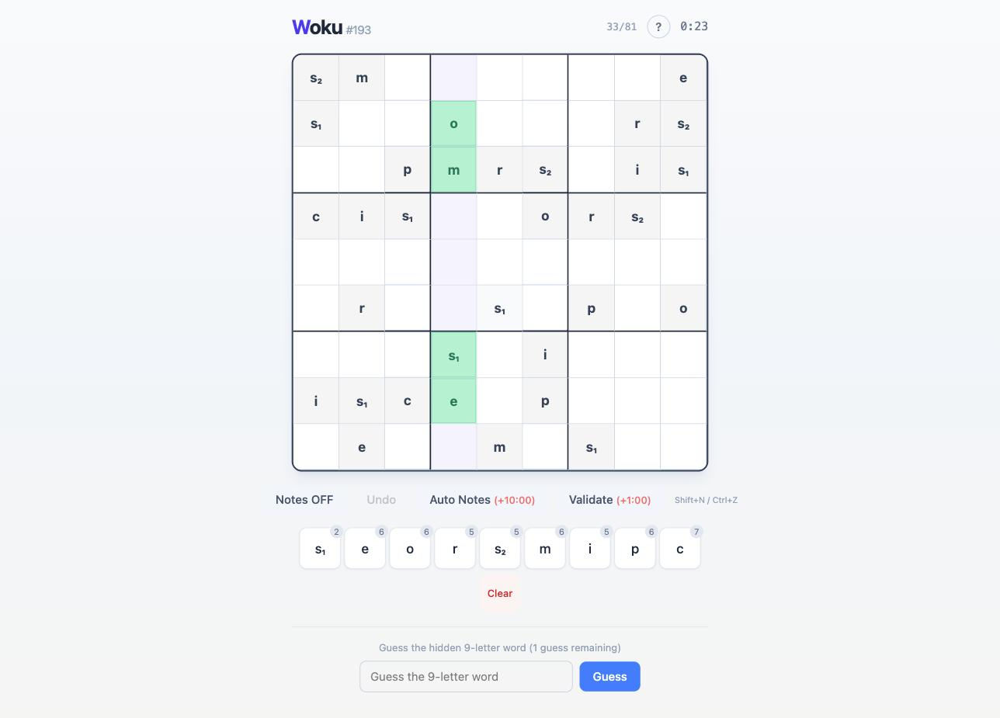
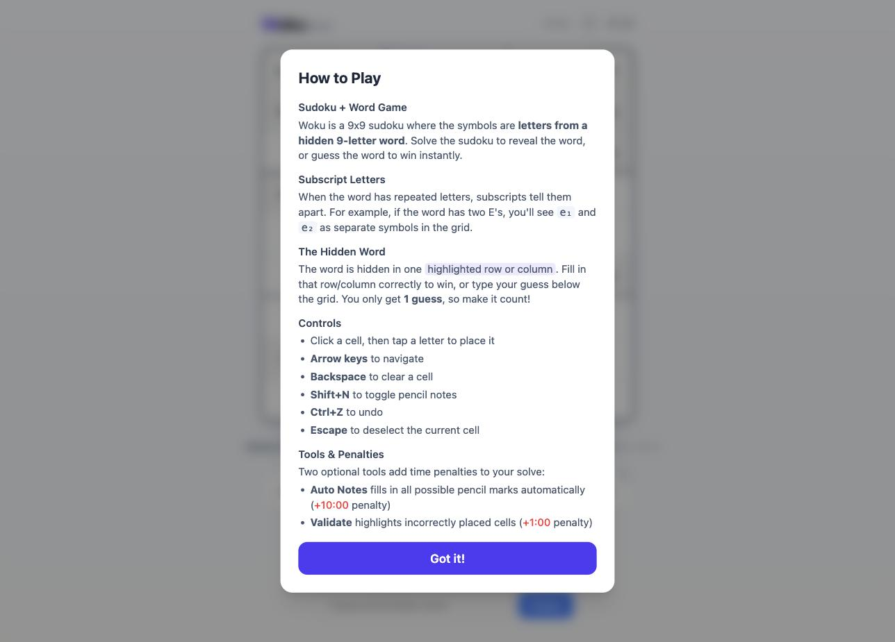

<div align="center">


**A daily puzzle that fuses Sudoku and Wordle.**
Solve a 9×9 letter grid with a hidden 9-letter word buried in one row or column — drawn from a pool of 1,876 words.

[](https://react.dev)
[](https://www.typescriptlang.org)
[](https://vitejs.dev)
[](https://tailwindcss.com)
[](LICENSE)
[](https://woku.jackvanzeeland.com)

</div>

<br />

<table>
<tr>
<td width="50%"></td>
<td width="50%"></td>
</tr>
</table>

## How It Works

- The grid uses **letters instead of numbers**. Each of the 9 unique symbols (derived from the daily word) appears exactly once per row, column, and 3×3 box.
- Duplicate letters in the word are distinguished with subscript digits (e.g. `s₁`, `s₂`).
- A **9-letter word** is hidden in a single row or column (possibly reversed). Completing that row/column — or guessing the word — wins the game.
- Each day, the number of pre-filled cells (givens) is randomly chosen between **28 and 35**, seeded by the date so every player gets the same puzzle.
- A new puzzle is generated every day, consistent for all players.

## Features

- **Daily puzzles** — deterministic per day via seeded PRNG (Mulberry32)
- **Notes mode** — toggle pencil marks per cell (`Shift+N`)
- **Auto Notes** — fills all valid candidates automatically (+10:00 penalty)
- **Validate** — highlights incorrect cells (+1:00 penalty)
- **Undo** — revert moves (`Ctrl`/`Cmd+Z`), up to 50 steps
- **Keyboard navigation** — arrow keys, letter keys to place, Backspace/Delete to clear
- **Word guess** — guess the hidden word Wordle-style with color-coded feedback (one guess, so make it count)
- **Persistent state** — progress saved to localStorage; resume where you left off
- **Timer** — tracks solve time including penalties; pauses when the tab is hidden

## Tech stack

- **[React 19](https://react.dev)** with TypeScript
- **[Vite 7](https://vitejs.dev)** for dev/build
- **[Tailwind CSS 4](https://tailwindcss.com)** for styling
- No external runtime dependencies beyond React

## Getting started

```bash
npm install
npm run dev
```

Open the local URL shown in the terminal.

## Scripts

| Command            | Description                          |
| ------------------ | ------------------------------------- |
| `npm run dev`       | Start dev server with hot reload      |
| `npm run build`     | Type-check and build for production   |
| `npm run preview`   | Preview the production build          |
| `npm run lint`       | Run ESLint                            |

## Project structure

```
src/
  engine/          # Core game logic
    sudoku-generator.ts   # Puzzle generation (randomize, embed word, dig holes)
    sudoku-solver.ts      # Backtracking solver (ensures unique solutions)
    symbols.ts             # Word-to-symbol mapping and display
    wordle.ts               # Wordle-style guess evaluation
  lib/             # Shared utilities and types
    constants.ts            # Grid size, givens range, etc.
    daily.ts                 # Daily word/seed selection (seeded PRNG)
    types.ts                  # TypeScript interfaces
  state/           # State management
    useGameState.ts          # Game reducer, timer, localStorage persistence
  components/      # React UI components
    Grid.tsx, Cell.tsx, SymbolPicker.tsx, WordGuess.tsx,
    Header.tsx, GameOverModal.tsx, HowToPlayModal.tsx
  App.tsx           # Root component
```

## Deploying

```bash
npx vercel
```

or connect the GitHub repo at [vercel.com/new](https://vercel.com/new).

## License

[MIT](LICENSE) © Jack Van Zeeland
